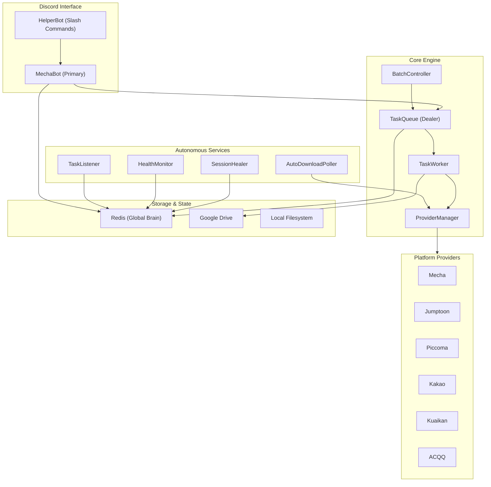
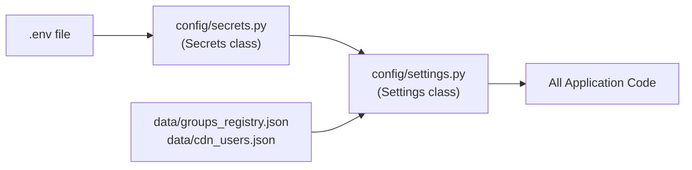
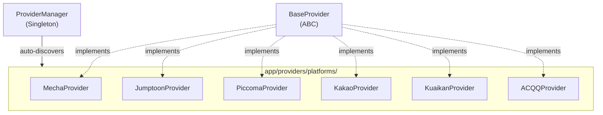
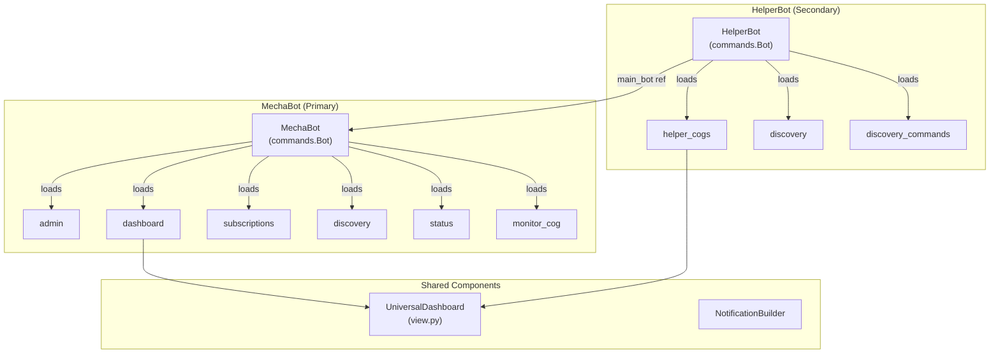
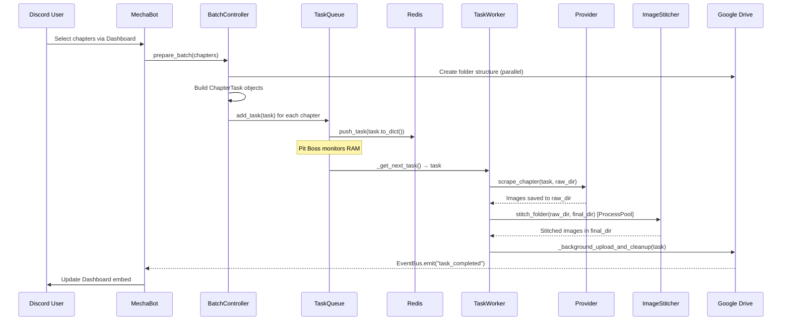
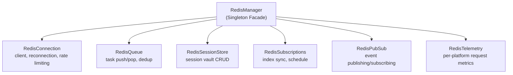
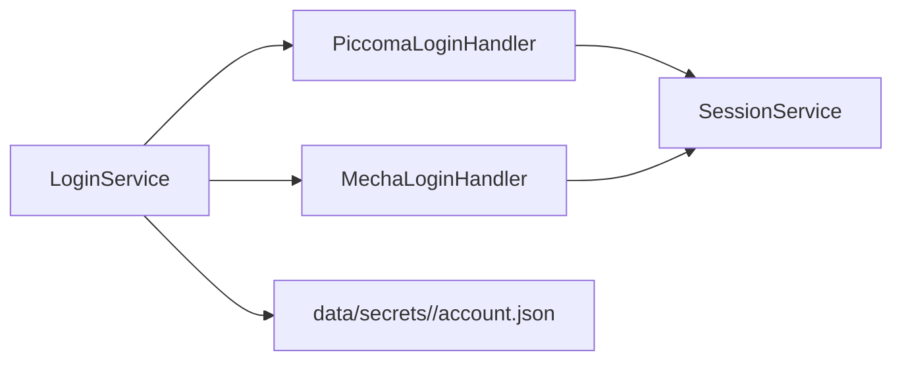
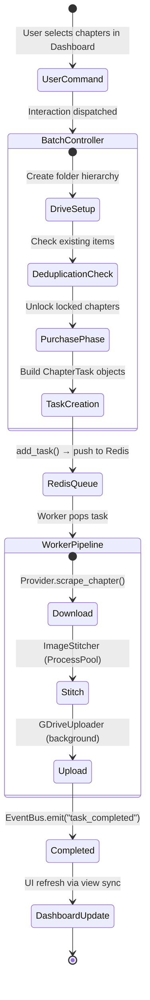
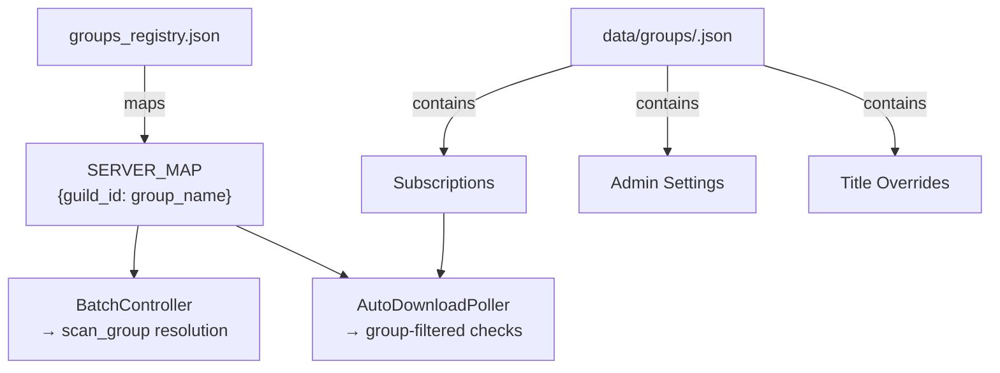
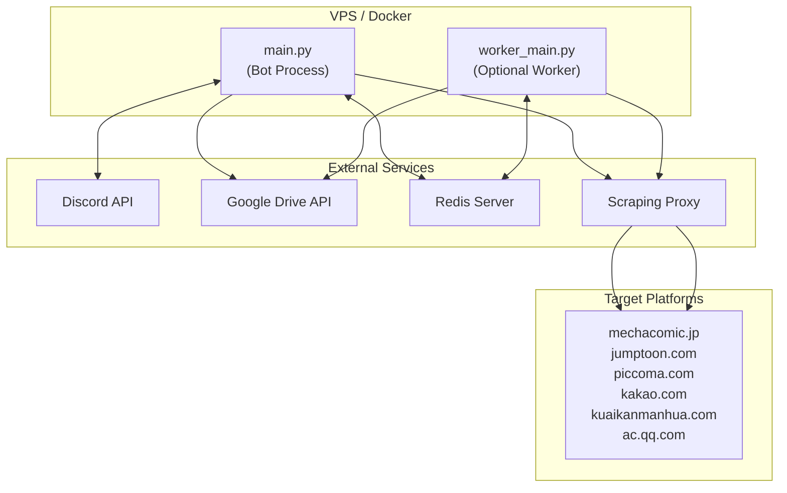

# Verzue — Codebase Architecture

> **Version:** Current as of April 2026  
> **Runtime:** Python 3.11+ / asyncio  
> **Primary Interface:** Discord Bot (discord.py)  
> **Backbone:** Redis (PubSub, Queues, Session Vault, Telemetry)

---

## 1. System Overview

Verzue (codename *MechaBot*) is a **distributed, multi-platform manga/webtoon scraping and delivery system** operated through Discord. It discovers new chapters across 6+ Japanese/Korean/Chinese comic platforms, scrapes protected image content (including DRM-descrambling), stitches pages into long-strip format, and uploads them to Google Drive — all orchestrated through a real-time Discord UI.



---

## 2. Directory Structure

```
Verzue/
├── main.py                    # Primary entrypoint (Bot + Autonomous Services)
├── worker_main.py             # Distributed worker entrypoint (Redis consumer)
├── generate_token.py          # Google OAuth token generator
├── docker-compose.yml         # Container orchestration
├── requirements.txt           # Python dependencies
├── .env                       # Environment secrets
│
├── config/                    # ── CONFIGURATION ──
│   ├── __init__.py
│   ├── settings.py            # Central Settings class (paths, IDs, constants)
│   └── secrets.py             # .env loader → Secrets class
│
├── app/                       # ── APPLICATION CODE ──
│   ├── __init__.py
│   │
│   ├── core/                  # ── CORE FRAMEWORK ──
│   │   ├── events.py          # EventBus (async pub/sub within process)
│   │   ├── exceptions.py      # Exception hierarchy (MechaException, ScraperError, etc.)
│   │   ├── logger.py          # Structured logging (console, file, per-request isolation)
│   │   ├── progress.py        # ProgressBar (console + dashboard sync)
│   │   ├── registry.py        # Legacy ScraperRegistry (deprecated, superseded by ProviderManager)
│   │   └── utils.py           # URL→platform detection, series ID extraction
│   │
│   ├── models/                # ── DATA MODELS ──
│   │   ├── chapter.py         # ChapterTask dataclass + TaskStatus enum
│   │   └── series.py          # SeriesInfo + SeriesChapterItem dataclasses
│   │
│   ├── bot/                   # ── DISCORD BOT LAYER ──
│   │   ├── main.py            # MechaBot class (primary bot, event handlers)
│   │   ├── helper_bot.py      # HelperBot class (secondary bot, slash commands)
│   │   ├── cogs/              # Command modules (loaded as discord.py extensions)
│   │   │   ├── admin.py       # Admin commands
│   │   │   ├── dashboard.py   # Interactive download dashboard UI
│   │   │   ├── subscriptions.py # Subscription management commands
│   │   │   ├── discovery.py   # Discovery system cog
│   │   │   ├── discovery_commands.py # Discovery slash commands (HelperBot)
│   │   │   ├── status.py      # System status/diagnostics commands
│   │   │   ├── monitor_cog.py # Live monitoring commands
│   │   │   ├── helper_cogs.py # HelperBot-specific UI cogs (~50KB)
│   │   │   ├── mecha.py       # Mecha-specific commands
│   │   │   ├── jumptoon.py    # Jumptoon-specific commands
│   │   │   ├── piccoma.py     # Piccoma-specific commands
│   │   │   ├── kakaopage.py   # Kakao-specific commands
│   │   │   ├── kuaikan.py     # Kuaikan-specific commands
│   │   │   └── acqq.py        # ACQQ-specific commands
│   │   └── common/            # Shared UI components
│   │       ├── view.py        # UniversalDashboard (interactive Discord embed, ~33KB)
│   │       └── notification_builder.py # V2 Component notification payloads
│   │
│   ├── providers/             # ── PLATFORM PROVIDER ENGINE ──
│   │   ├── base.py            # BaseProvider ABC (interface contract)
│   │   ├── manager.py         # ProviderManager singleton (dynamic discovery + routing)
│   │   └── platforms/         # Platform implementations
│   │       ├── mecha.py       # MechaComic provider (~30KB)
│   │       ├── jumptoon.py    # Jumptoon provider (~34KB)
│   │       ├── kakao.py       # Kakao Webtoon provider (~12KB)
│   │       ├── kuaikan.py     # Kuaikan Manhua provider (~5KB)
│   │       ├── acqq.py        # Tencent ACQQ provider (~7KB)
│   │       └── piccoma/       # Piccoma provider (modularized package)
│   │           ├── __init__.py
│   │           ├── provider.py    # Main PiccomaProvider class (~13KB)
│   │           ├── session.py     # Session/cookie management
│   │           ├── discovery.py   # Series info extraction
│   │           ├── purchase.py    # Chapter unlocking/purchase
│   │           ├── drm.py         # Image DRM decryption
│   │           └── helpers.py     # Shared utilities
│   │
│   ├── services/              # ── SERVICE LAYER ──
│   │   ├── batch_controller.py    # Orchestrates multi-chapter download batches
│   │   ├── session_service.py     # Session rotation, failure reporting, telemetry
│   │   ├── session_healer.py      # Auto-healing expired sessions via Redis PubSub
│   │   ├── health_monitor.py      # Proactive fleet health scanning (10-min interval)
│   │   ├── task_listener.py       # Redis PubSub → local dashboard sync
│   │   ├── group_manager.py       # Multi-tenant group/subscription CRUD (~14KB)
│   │   ├── ui_manager.py          # Dashboard refresh dispatcher
│   │   ├── redis_manager.py       # Redis orchestrator singleton (facade)
│   │   ├── login_service.py       # Re-export stub → login/service.py
│   │   │
│   │   ├── login/                 # ── LOGIN SERVICE PACKAGE ──
│   │   │   ├── __init__.py
│   │   │   ├── service.py         # LoginService (credential storage, auto-login orchestrator)
│   │   │   ├── piccoma_login.py   # Piccoma headless login handler
│   │   │   └── mecha_login.py     # Mecha headless login handler
│   │   │
│   │   ├── redis/                 # ── REDIS SUB-MODULES ──
│   │   │   ├── connection.py      # RedisConnection (client, reconnection, rate limiting)
│   │   │   ├── queue.py           # RedisQueue (task push/pop, dedup)
│   │   │   ├── sessions.py        # RedisSessionStore (session vault CRUD)
│   │   │   ├── subscriptions.py   # RedisSubscriptions (index sync, schedule)
│   │   │   ├── pubsub.py          # RedisPubSub (event publishing/subscribing)
│   │   │   └── telemetry.py       # RedisTelemetry (request metrics)
│   │   │
│   │   ├── gdrive/                # ── GOOGLE DRIVE SERVICE ──
│   │   │   ├── client.py          # GDriveClient (OAuth, service init)
│   │   │   ├── uploader.py        # GDriveUploader (folder CRUD, file upload, shortcuts)
│   │   │   └── sync_service.py    # Drive sync utilities
│   │   │
│   │   ├── browser/               # ── BROWSER SERVICE ──
│   │   │   └── unlocker.py        # BatchUnlocker (API-driven chapter purchase)
│   │   │
│   │   └── image/                 # ── IMAGE PROCESSING ──
│   │       ├── stitcher.py        # ImageStitcher (vertical page stitching)
│   │       ├── optimizer.py       # Image optimization/compression
│   │       └── smart_detector.py  # Content-aware split point detection
│   │
│   ├── tasks/                 # ── TASK PIPELINE ──
│   │   ├── manager.py         # TaskQueue (Redis-backed, RAM-auto-scaling workers)
│   │   ├── worker.py          # TaskWorker (3-stage: scrape → stitch → upload)
│   │   ├── poller.py          # AutoDownloadPoller (daily/high-freq/hiatus loops)
│   │   ├── notifier.py        # PollerNotifier (V2 Discord notifications)
│   │   └── discovery_poller.py # DiscoveryPoller (new series premiere detection)
│   │
│   └── lib/                   # ── LIBRARIES ──
│       └── pycasso/           # DRM image descrambler
│           ├── __init__.py
│           ├── __main__.py    # CLI entry
│           ├── cipher.py      # Cipher implementation
│           ├── constants.py   # Magic constants
│           ├── prng.py        # PRNG for seed generation
│           ├── shuffleseed.py # Shuffle-seed algorithm
│           └── unscramble.py  # Core unscramble logic
│
├── data/                      # ── PERSISTENT DATA ──
│   ├── groups_registry.json   # Group→Server ID mapping
│   ├── cdn_users.json         # CDN access whitelist
│   ├── groups/                # Per-group subscription profiles (JSON)
│   └── secrets/               # Platform credentials (per-platform dirs)
│
├── docs/                      # ── DOCUMENTATION ──
│   ├── piccoma_automated_login.md
│   ├── piccoma_cookie_management.md
│   └── piccoma_wait_free_unlock.md
│
├── tools/                     # ── DEVELOPMENT TOOLS ──
│   ├── decode_piccoma.py      # DRM analysis tools
│   ├── find_wasm.py           # WASM extraction utilities
│   └── test_*.py              # Various test scripts
│
├── scripts/
│   └── diag_dump.py           # Diagnostic dump utility
│
├── downloads/                 # Temporary download workspace (auto-cleaned)
├── logs/                      # Structured log output
│   ├── bot.log                # Master log file
│   ├── Requests/              # Per-group, per-request log files
│   └── Notification/          # Notification-specific logs
└── tmp/                       # Temporary files
```

---

## 3. Core Subsystems

### 3.1 Configuration Layer



| Class | Responsibility |
|---|---|
| **`Secrets`** | Loads sensitive values from `.env` via `python-dotenv`. Surfaces `DISCORD_TOKEN`, `HELPER_TOKEN`, `STAGING_TOKEN`, `REDIS_URL`, `SCRAPING_PROXY`, `DEVELOPER_MODE`. |
| **`Settings`** | Static configuration singleton. Defines all paths (`BASE_DIR`, `DATA_DIR`, `DOWNLOAD_DIR`, etc.), Discord channel IDs, Google Drive root, logging config, rate-limit constants, and group registry management. Runs migration logic from legacy data formats on `ensure_dirs()`. |

---

### 3.2 Core Framework (`app/core/`)

| Module | Purpose |
|---|---|
| [events.py](file:///e:/Code%20Files/Verzue/app/core/events.py) | **`EventBus`** — In-process async pub/sub. Class-level `subscribe(event, callback)` and `emit(event, *args)`. Used for decoupling: `upload_zip_to_discord`, `send_direct_link`, `task_failed`, `task_completed`, `subscription_added`, `session_status_changed`. |
| [exceptions.py](file:///e:/Code%20Files/Verzue/app/core/exceptions.py) | **Exception hierarchy** with error codes. `MechaException` (base) → `ScraperError` (`SC_001`) → `LoginRequiredError` (`AC_001`) / `NetworkTimeoutError` (`DL_001`). Also `DriveUploadError` (`DR_002`). |
| [logger.py](file:///e:/Code%20Files/Verzue/app/core/logger.py) | **3-tier logging**: (1) Colorized console with `CustomFormatter`, (2) Master `bot.log` file, (3) `StructuredFileHandler` routing to `logs/<Category>/<Group>/<RequestID>.log`. Uses `contextvars` for request-scoped context (`req_id`, `group_name`, `log_category`, `chapter_id`). |
| [progress.py](file:///e:/Code%20Files/Verzue/app/core/progress.py) | **`ProgressBar`** — Real-time console progress with milestone-based file logging (25/50/75/100%) and dashboard sync via `UniversalDashboard.active_views`. |
| [utils.py](file:///e:/Code%20Files/Verzue/app/core/utils.py) | URL→platform name mapping (`get_service_name`) and multi-platform series ID extraction (`extract_series_id`). |
| [registry.py](file:///e:/Code%20Files/Verzue/app/core/registry.py) | **Legacy** `ScraperRegistry` — superseded by `ProviderManager`. Still present but imports are stale. |

---

### 3.3 Data Models (`app/models/`)

#### `ChapterTask` ([chapter.py](file:///e:/Code%20Files/Verzue/app/models/chapter.py))

The primary unit of work flowing through the entire pipeline. A `@dataclass` containing:

| Field Group | Fields |
|---|---|
| **Identity** | `id`, `title`, `chapter_str`, `url`, `series_title`, `req_id` |
| **Platform** | `series_id_key`, `episode_id`, `episode_number`, `service`, `is_smartoon` |
| **Context** | `requester_id`, `channel_id`, `guild_id`, `guild_name`, `scan_group` |
| **Drive State** | `pre_created_folder_id`, `final_folder_name`, `main_folder_id`, `client_folder_id`, `client_folders`, `series_title_id` |
| **Processing** | `status` (TaskStatus enum), `share_link`, `purchase_progress`, `purchase_status`, `error_message` |
| **Dedup** | `waiters` — list of `(req_id, view_ref)` pairs blocked on this task |

**`TaskStatus`** enum: `QUEUED → PROCESSING → DOWNLOADING → UNSCRAMBLING → STITCHING → UPLOADING → COMPLETED / FAILED`

Serialization: `to_dict()` / `from_dict()` for Redis transport.

#### `SeriesInfo` / `SeriesChapterItem` ([series.py](file:///e:/Code%20Files/Verzue/app/models/series.py))

Lightweight metadata used for UI chapter selection. `SeriesInfo` holds title, total chapters, provider, image URL, and a list of `SeriesChapterItem` (index, display_id, title, url, is_paid, is_free).

---

### 3.4 Provider Engine (`app/providers/`)



#### `BaseProvider` ([base.py](file:///e:/Code%20Files/Verzue/app/providers/base.py))

Abstract interface defining the provider contract:

| Method | Purpose |
|---|---|
| `get_series_info(url)` | Returns 9-tuple: `(title, total_chapters, chapter_list, image_url, series_id, release_day, release_time, status_label, genre_label)` |
| `scrape_chapter(task, output_dir)` | Downloads and processes a single chapter's images |
| `is_session_valid(session)` | Validates authentication state |
| `fast_purchase(task)` | API-driven chapter unlocking |
| `run_ritual(session)` | Anti-detection behavioral simulation (default no-op) |

#### `ProviderManager` ([manager.py](file:///e:/Code%20Files/Verzue/app/providers/manager.py))

**Singleton** with dynamic discovery at import time. Scans `app/providers/platforms/` for:
- `.py` files containing `BaseProvider` subclasses
- Subdirectories with `__init__.py` exporting a provider

Routing methods:
- `get_provider(platform_name)` — with alias normalization (e.g. `"mechacomic"` → `"mecha"`)
- `get_provider_for_url(url)` — domain-based routing
- `list_providers()` — returns loaded platform identifiers

#### Platform Implementations

| Provider | File | Size | Notes |
|---|---|---|---|
| **Mecha** | `mecha.py` | 30KB | Largest provider. Supports alerts-page batch optimization. |
| **Jumptoon** | `jumptoon.py` | 34KB | In-source DRM descrambling. |
| **Piccoma** | `piccoma/` (package) | ~48KB total | Modularized into 6 sub-modules: provider, session, discovery, purchase, DRM, helpers. |
| **Kakao** | `kakao.py` | 12KB | Kakao Webtoon API. |
| **Kuaikan** | `kuaikan.py` | 5KB | Kuaikan Manhua (Chinese). |
| **ACQQ** | `acqq.py` | 7KB | Tencent AC.QQ Comics. |

---

### 3.5 Discord Bot Layer (`app/bot/`)



#### `MechaBot` ([main.py](file:///e:/Code%20Files/Verzue/app/bot/main.py))

Primary bot instance. Key responsibilities:
- **Extension Loading**: 6 cog modules loaded at startup
- **EventBus Subscriptions**: Handles `upload_zip_to_discord`, `send_direct_link`, `task_failed`, `subscription_added`
- **UI Manager**: Starts `UIManager` for dashboard refresh coordination
- **Worker Startup**: Creates `task_queue.start_worker(num_workers=2)` task
- **Poller Startup**: Initializes `AutoDownloadPoller`
- **Global Error Handling**: `dispatch_error()` crash sentinel reports to admin channel
- **Redis Status Alerts**: `handle_redis_lost` / `handle_redis_connected` notifications

#### `HelperBot` ([helper_bot.py](file:///e:/Code%20Files/Verzue/app/bot/helper_bot.py))

Secondary bot instance (separate token) dedicated to slash commands. Holds a reference to the main bot for shared state (task queue, etc.). Loads 3 extensions.

#### `UniversalDashboard` ([view.py](file:///e:/Code%20Files/Verzue/app/bot/common/view.py), ~33KB)

The most complex UI component. An interactive Discord embed that tracks download progress in real-time. Maintains a class-level `active_views` dict mapping `req_id` → view instance, enabling:
- Same-process status sync from `TaskWorker._sync_view_status()`
- Cross-process sync via `TaskListener` subscribing to Redis PubSub

---

### 3.6 Task Pipeline (`app/tasks/`)



#### `BatchController` ([batch_controller.py](file:///e:/Code%20Files/Verzue/app/services/batch_controller.py))

Orchestrates the preparation of multi-chapter download batches:
1. **Google Drive Setup**: Creates hierarchical folder structure: `Raws / <Platform> / [<SeriesID>] - <Title> / MAIN + <Group> Team folders`
2. **Deduplication**: Checks existing MAIN folder items, creates shortcuts for already-completed chapters  
3. **Purchase Coordination**: Dispatches locked chapters to `BatchUnlocker`
4. **Task Creation**: Builds `ChapterTask` objects with pre-populated Drive folder IDs

#### `TaskQueue` ([manager.py](file:///e:/Code%20Files/Verzue/app/tasks/manager.py))

Redis-backed distributed task queue with **RAM-auto-scaling workers**:

- **The Dealer**: Round-robin task distribution from Redis
- **The Pit Boss**: Background loop (10s interval) monitoring `psutil.virtual_memory()`:
  - Formula: `affordable_workers = (available_MB - 700MB buffer) / 200MB per worker`
  - Caps at 15 workers max, never drops below 1
  - Can "tap" workers to exit when RAM is critical
- **Deduplication**: `series_id_key:episode_id` tracked as Redis active task keys
- **Hibernation**: Workers sleep during Redis outages

#### `TaskWorker` ([worker.py](file:///e:/Code%20Files/Verzue/app/tasks/worker.py))

Executes the 3-stage pipeline per chapter:

| Stage | What Happens | Concurrency Control |
|---|---|---|
| **1. Download** | Provider scrapes chapter images | Per-platform `asyncio.Lock` (rate limiting) |
| **2. Stitch** | `ImageStitcher.stitch_folder()` in `ProcessPoolExecutor(4)` | `STITCH_SEMAPHORE(3)` |
| **3. Upload** | Concurrent Google Drive file uploads | `GLOBAL_UPLOAD_SEMAPHORE(5)` — fire-and-forget background task |

Key features:
- **Parallel Drive Prep**: Folder creation starts concurrently with download
- **Background Upload**: Upload runs in a detached `asyncio.create_task()`, freeing the worker immediately
- **Real-time UI Sync**: `_sync_view_status()` updates both local `UniversalDashboard` views and publishes to Redis PubSub
- **Structured Logging**: Full `contextvars` injection for per-request tracing

#### `AutoDownloadPoller` ([poller.py](file:///e:/Code%20Files/Verzue/app/tasks/poller.py))

Automated subscription monitoring with 3 polling strategies:

| Loop | Frequency | Purpose |
|---|---|---|
| `poll_loop` | Once daily at 15:05 UTC | Full subscription scan (day-filtered) |
| `high_freq_poll_loop` | Every 10s (15:00–15:05 UTC only) | Rapid-fire checking for JP/KR platforms |
| `smart_batch_poll_loop` | Every 30 min | Hiatus series daily sweep (via Redis TTL) |

- **Mecha Batch Optimization**: Uses alerts page API to batch-check multiple series in one request
- **Auto-Detection**: Automatically populates missing `release_day` and `status` metadata
- **Redis Dedup Keys**: `verzue:poller:found:<series_id>:<date>` prevents duplicate notifications

#### `DiscoveryPoller` ([discovery_poller.py](file:///e:/Code%20Files/Verzue/app/tasks/discovery_poller.py))

New series premiere detection engine:
- Runs every 10s within a narrow UTC window (15:00:01–15:03:00)
- Checks Jumptoon, Piccoma, Mecha for new series via `provider.get_new_series_list()`
- Uses Redis sets (`verzue:seen:<platform>_new_series`) for brain memory
- First-run silent seeding to avoid flooding

---

### 3.7 Redis Backbone (`app/services/redis/`)



**`RedisManager`** is a **singleton facade** that delegates to 6 specialized sub-modules:

| Sub-Module | Key Responsibilities |
|---|---|
| **Connection** | Client initialization, reconnection with exponential backoff, Lua-script-based token bucket rate limiting |
| **Queue** | `verzue:tasks:global` list for task distribution. `verzue:active:<key>` for cross-process deduplication |
| **SessionStore** | `verzue:sessions:<platform>:<account_id>` hashes. Batch retrieval, CRUD operations |
| **Subscriptions** | Index sync between local JSON and Redis. Schedule management for release-day optimization |
| **PubSub** | Two channels: `verzue:events:session` (session lifecycle) and `verzue:events:tasks` (task status updates) |
| **Telemetry** | Per-platform daily counters: `success_count`, `total_requests`, `error_types` |

---

### 3.8 Autonomous Health Services

Three background services run as fire-and-forget `asyncio.create_task()` from `main.py`:

#### `SessionService` ([session_service.py](file:///e:/Code%20Files/Verzue/app/services/session_service.py))

Central session management:
- **Random Rotation**: Selects from healthy sessions for load balancing
- **Failure Reporting**: Marks sessions `EXPIRED`, records telemetry, publishes `session_expired` events
- **Cookie Update**: Refreshes session cookies and resets to `HEALTHY`
- **Per-platform `asyncio.Lock`** for concurrent login prevention

#### `SessionHealer` ([session_healer.py](file:///e:/Code%20Files/Verzue/app/services/session_healer.py))

Reactive + proactive healing:
- Subscribes to `verzue:events:session` Redis PubSub channel
- On `session_expired` → dispatches to `LoginService.auto_login()`
- On `run_ritual` → executes `provider.run_ritual()` behavioral simulation
- On startup → scans all platforms for already-`EXPIRED` sessions

#### `HealthMonitor` ([health_monitor.py](file:///e:/Code%20Files/Verzue/app/services/health_monitor.py))

Proactive fleet scanning (every 10 minutes):
- Checks session aging (>12 hours since last ritual → triggers `run_ritual`)
- Monitors Success Rate (SSR < 30% → marks session `AT_RISK`)
- Logs per-platform health reports

#### `TaskListener` ([task_listener.py](file:///e:/Code%20Files/Verzue/app/services/task_listener.py))

Redis-to-UI bridge:
- Subscribes to `verzue:events:tasks` channel
- On `task_updated` → syncs remote worker progress to local `UniversalDashboard` views
- Enables real-time dashboard updates when tasks are processed by distributed workers

---

### 3.9 Login Service (`app/services/login/`)



- **Credential Storage**: JSON files in `data/secrets/<platform>/account.json`
- **Auto-Login**: 3-attempt retry bridge with exponential backoff
- **Platform Handlers**: Headless HTTP-based login (no browser) using `curl_cffi`

---

### 3.10 Image Processing (`app/services/image/`)

| Module | Purpose |
|---|---|
| `stitcher.py` | Vertical page stitching — combines raw manga pages into long-strip JPEG images. Max height configurable (`STITCH_HEIGHT = 15000px`). Runs in `ProcessPoolExecutor`. |
| `optimizer.py` | Image compression and optimization for upload efficiency. |
| `smart_detector.py` | Content-aware split detection — finds optimal vertical break points in stitched images. |

---

### 3.11 Pycasso Library (`app/lib/pycasso/`)

Self-contained DRM descrambling library for manga platforms that use tile-shuffling protection. Implements:
- **PRNG**: Pseudo-random number generator seeded from series/episode IDs
- **Cipher**: XOR-based cipher for key derivation
- **ShuffleSeed**: Deterministic permutation generation
- **Unscramble**: Inverse tile-shuffle to reconstruct the original image

---

## 4. Data Flow: End-to-End Chapter Download



---

## 5. Event Architecture

### In-Process EventBus Events

| Event | Producer | Consumer |
|---|---|---|
| `upload_zip_to_discord` | TaskWorker | MechaBot |
| `send_direct_link` | TaskWorker | MechaBot |
| `task_failed` | TaskWorker / TaskQueue | MechaBot (user + admin alerts) |
| `task_completed` | TaskWorker | MechaBot |
| `task_started` | TaskQueue | — |
| `subscription_added` | Cogs | MechaBot (central log notification) |
| `session_status_changed` | SessionService | — |

### Redis PubSub Channels

| Channel | Events | Purpose |
|---|---|---|
| `verzue:events:session` | `session_expired`, `run_ritual` | SessionHealer listens for healing triggers |
| `verzue:events:tasks` | `task_updated` | TaskListener syncs remote worker state to local dashboards |

---

## 6. Multi-Tenancy & Group System



- **Group Registry**: `data/groups_registry.json` maps Discord guild IDs to group names
- **Per-Group Profiles**: `data/groups/<GroupName>.json` contains subscriptions, admin settings, title vault
- **Channel-Level Mapping**: `SERVER_MAP` supports both guild-level and channel-level group assignment
- **Multi-Group Downloads**: `get_interested_groups(url)` returns all groups subscribed to a series for cross-group Google Drive shortcut creation

---

## 7. Deployment Topology



### Two-Process Architecture

| Process | Entrypoint | Role |
|---|---|---|
| **Bot Process** | `main.py` | Discord connection, UI, autonomous services, worker pool |
| **Worker Process** | `worker_main.py` | Optional distributed worker consuming from the same Redis queue |

Both processes share state through Redis. The Bot Process also runs internal workers via `start_worker(num_workers=2)`, so the Worker Process is only needed for horizontal scaling.

### Key Infrastructure

- **Redis**: Single instance, required. Used for task queuing, session persistence, PubSub, telemetry, and deduplication
- **Google Drive**: OAuth2 with service account credentials (`data/secrets/credentials.json` + `token.pickle`)
- **Proxy**: Optional SOCKS/HTTP proxy for scraping requests (`SCRAPING_PROXY` env var)
- **Docker**: `docker-compose.yml` defines a single container running `main.py`

---

## 8. Dependencies

| Package | Purpose |
|---|---|
| `discord.py` | Discord bot framework |
| `curl_cffi` | TLS fingerprint-impersonating HTTP client (anti-detection) |
| `redis` | Async Redis client |
| `Pillow` | Image processing (stitching, optimization) |
| `numpy` | Image array operations |
| `beautifulsoup4` | HTML parsing |
| `cryptography` | DRM decryption |
| `google-api-python-client` | Google Drive API |
| `google-auth-oauthlib` | Google OAuth2 |
| `psutil` | System resource monitoring (RAM-based auto-scaling) |
| `python-dotenv` | Environment variable loading |

---

## 9. Key Design Patterns

| Pattern | Where | Why |
|---|---|---|
| **Singleton** | `ProviderManager`, `RedisManager`, `TaskListener` | Single instance per process for shared state |
| **Facade** | `RedisManager` | Single API surface over 6 specialized Redis sub-modules |
| **Strategy** | `BaseProvider` + platform implementations | Pluggable platform-specific scraping logic |
| **Observer** | `EventBus`, Redis PubSub | Loose coupling between bot, workers, and services |
| **Auto-Scaling** | `TaskQueue._pit_boss_loop()` | Dynamic worker count based on real-time RAM telemetry |
| **Circuit Breaking** | `SessionService` / `SessionHealer` | Expired sessions quarantined; throttled refresh attempts |
| **Structured Context** | `contextvars` in logger | Request-scoped logging without manual threading |
| **Fire-and-Forget** | Upload stage, folder creation | Non-blocking background operations via `asyncio.create_task()` |
| **Semaphore-Based Throttling** | `STITCH_SEMAPHORE(3)`, `GLOBAL_UPLOAD_SEMAPHORE(5)` | Prevents CPU/API thrashing during parallel operations |
